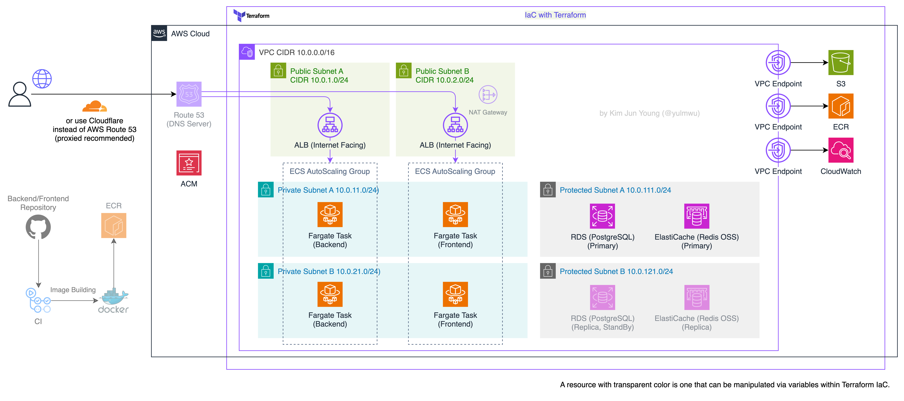

```shell
cp env/dev.tfvars.example env/dev.tfvars
cp env/example.backend.hcl env/dev.backend.hcl

# if you need prod and staging environments, uncomment the lines below
# cp env/prod.tfvars.example env/prod.tfvars
# cp env/staging.tfvars.example env/staging.tfvars
# cp env/example.backend.hcl env/prod.backend.hcl
# cp env/example.backend.hcl env/staging.backend.hcl

terraform init -backend-config="env/dev.backend.hcl"
terraform apply -var-file="env/dev.tfvars"
```

For detailed options(variables), see [`env/dev.tfvars.example`](env/dev.tfvars.example). 

If you have received an ACM SSL certificate for HTTPS communication, set `certificate_arn`. Setting `certificate_arn` adds HTTPS listeners, security group rules, and redirect actions to the ALBs.


